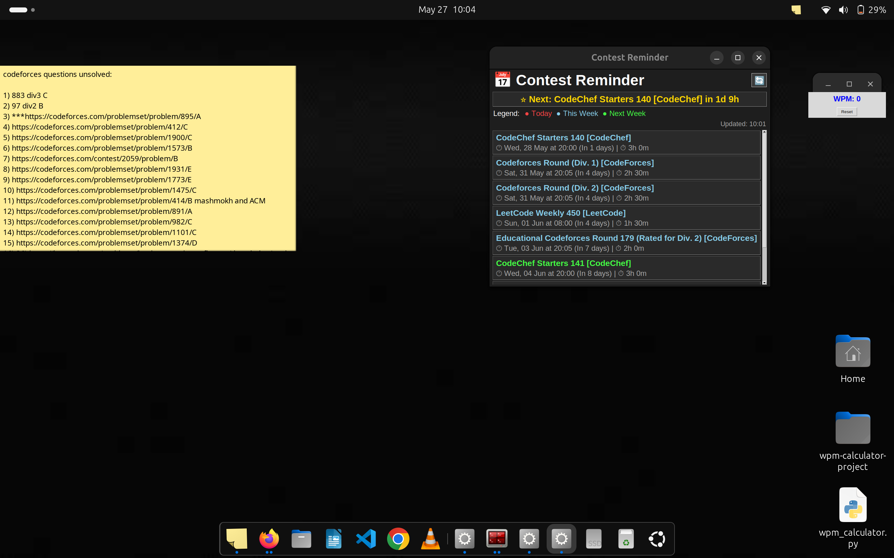

# 🏆 Contest Reminder

A desktop application for Linux that tracks upcoming programming contests from multiple platforms and displays them in a unified interface.


## 📋 Description

Contest Reminder is a lightweight GUI application designed for competitive programmers who want to keep track of upcoming contests across different platforms. Built with Python and Tkinter, it provides a clean interface to view all your contests in one place.

## 📸 Screenshot



## ✨ Features

- **Multi-platform Support**: Tracks contests from CodeForces, CodeChef, and LeetCode
- **Real-time Updates**: Automatically fetches the latest contest information
- **Auto-refresh**: Updates every 30 minutes to ensure you have the latest data
- **Color-coded Timeline**: Visual indicators for contest timing
  - Red: Contests happening today
  - Sky Blue: Contests this week
  - Green: Contests next week
- **Next Contest Highlight**: Prominently displays the nearest upcoming contest with countdown
- **One-click Access**: Click any contest to open it directly in your browser
- **Auto-start on Boot**: Configurable to start automatically when you log into Linux
- **Dark Theme**: Easy on the eyes during long coding sessions
- **Lightweight**: Minimal resource usage

## 🛠️ Technology Stack

- **Language**: Python 3.8+
- **GUI Framework**: Tkinter
- **Dependencies**: requests, python-dateutil, pytz
- **Platform**: Linux (Ubuntu, Fedora, Arch, etc.)

## 📦 Installation

### Prerequisites

- Python 3.8 or higher
- pip (Python package manager)
- Git
- Linux operating system

### Step-by-Step Installation

1. **Clone the repository**
   ```bash
   git clone https://github.com/YOUR_USERNAME/contest-reminder.git
   cd contest-reminder
   ```

2. **Create a virtual environment**
   ```bash
   python3 -m venv venv
   source venv/bin/activate
   ```

3. **Install required packages**
   ```bash
   pip install -r requirements.txt
   ```

4. **Run the application**
   ```bash
   python contest_gui.py
   ```

## 🚀 Auto-start Configuration (Linux)

To have Contest Reminder start automatically when you log in:

1. **Create a desktop entry**
   ```bash
   cat > ~/.local/share/applications/contest-reminder.desktop << 'EOL'
   [Desktop Entry]
   Type=Application
   Name=Contest Reminder
   Exec=bash -c "sleep 10 && cd $HOME/contest-reminder && source venv/bin/activate && python contest_gui.py"
   Hidden=false
   Terminal=false
   X-GNOME-Autostart-enabled=true
   EOL
   ```

2. **Enable auto-start**
   ```bash
   mkdir -p ~/.config/autostart
   cp ~/.local/share/applications/contest-reminder.desktop ~/.config/autostart/
   ```

## 🎯 Supported Platforms

### CodeForces
- Tracks all upcoming rounds (Div. 1, Div. 2, Div. 3, Educational)
- Real-time data from CodeForces API
- Direct links to contest pages

### CodeChef
- Weekly Starters (Every Wednesday at 8:00 PM IST)
- Long challenges and Cook-offs
- Automatic schedule generation

### LeetCode
- Weekly contests (Sundays at 8:00 AM IST)
- Biweekly contests
- Direct contest links

## ⚙️ Configuration

### Window Position
The application window position can be customized by modifying the geometry settings in `contest_gui.py`:
```python
x_position = screen_width - 1100  # Distance from right edge
self.root.geometry(f"700x500+{x_position}+150")
```

### Refresh Interval
Default refresh interval is 30 minutes. To modify:
```python
self.root.after(1800000, self.auto_refresh)  # Time in milliseconds
```

### Color Scheme
Colors can be customized by modifying the color constants in the `__init__` method:
```python
self.bg_color = "#1e1e1e"        # Background
self.fg_color = "#ffffff"        # Foreground
self.today_color = "#ff4444"     # Today's contests
self.this_week_color = "#87CEEB" # This week's contests
self.next_week_color = "#44ff44" # Next week's contests
```

## 📁 Project Structure

```
contest-reminder/
├── contest_gui.py          # Main application file
├── requirements.txt        # Python dependencies
├── README.md              # Project documentation
├── LICENSE                # MIT License
├── .gitignore            # Git ignore file
├── contest-reminder-screenshot.png  # Application screenshot
└── venv/                 # Virtual environment (not in repo)
```

## Contributing

Contributions are welcome! Here are some ways you can contribute:

- Add support for more contest platforms (AtCoder, TopCoder, etc.)
- Implement desktop notifications
- Add contest filtering options
- Improve the UI/UX design
- Add contest statistics tracking
- Create platform-specific contest reminders

### How to Contribute

1. Fork the repository
2. Create a feature branch (`git checkout -b feature/AmazingFeature`)
3. Commit your changes (`git commit -m 'Add some AmazingFeature'`)
4. Push to the branch (`git push origin feature/AmazingFeature`)
5. Open a Pull Request

##  Known Issues

- Scrolling might need configuration on some Linux distributions
- Contest times are displayed in IST (Indian Standard Time)
- Some contest platforms might change their API structure

## 📝 License

This project is licensed under the MIT License - see the [LICENSE](LICENSE) file for details.

##  Acknowledgments

- CodeForces for providing a public API
- The competitive programming community
- Contributors and users of this application

**Happy Coding and Never Miss a Contest Again!** 🚀
